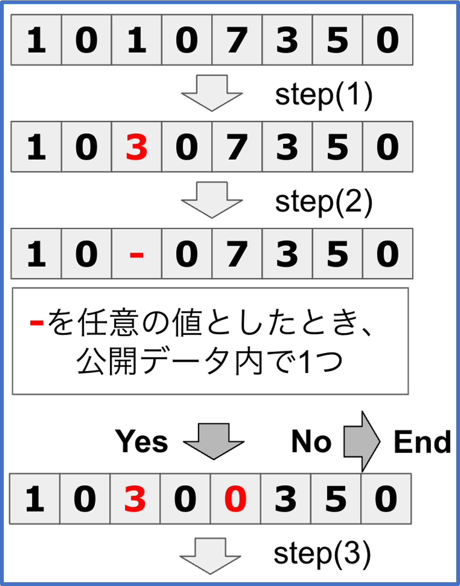

# ランダム置換

## Step1 
各行先頭列以外からランダムな1列を加工
## Step2 
各行、Step1 で加工した列を任意の値としたときに、公開データと比較し一意に定まる行を探索
追加でまだ加工されていない列から1列選び加工する
## Step3 
Steo1,Step2 で加工した列を任意の値としたときに、公開データと比較し一意に定まる行を探索
追加でまだ加工されていない列から1列選び加工する

各行最大3列加工する。
処理のイメージ図
